<div align="center">

<div align="center">
  
</div>

# burp-cli

### Command-Line Power for Burp Suite Professional

**Take full control of Burp Suite Professional REST API with automated scanning, scheduling, reporting, and management capabilities.**

[](https://golang.org/)
[](LICENSE)
[](https://github.com/cihanmehmet/burp-cli/releases)
[](http://makeapullrequest.com)

[✨ Features](#-key-features) •
[🚀 Quick Start](#-quick-start) •
[📖 Documentation](#-usage-examples) •
[⚙️ Installation](#-installation) •
[🤝 Contributing](#-contributing)

</div>

---

## 🎯 What is burp-cli?

**burp-cli** is a command-line tool that automates and manages security testing by working directly with Burp Suite Professional's REST API.

### What Can You Do?

```bash
# Scan single URL
burp-cli -s "https://example.com" -a

# Scan multiple URLs
burp-cli -sl urls.txt -a

# Scan from Nmap results
burp-cli -sn nmap.xml -a

# Automated scheduled scanning
burp-cli schedule create daily --time 21:00 --url "https://example.com" --auto-export

# List all scans (auto-sync)
burp-cli -L

# Bulk export all scans
burp-cli -LA
```

<div align="center">

### 🎬 Demo

```bash
$ burp-cli -s "https://api.example.com" -a

[+] Starting scan: https://api.example.com
[+] Scan ID: 15
[+] Status: running
[+] Waiting for completion...
[+] Scan completed successfully!
[+] Auto-exporting results...
    ✓ JSON: burp-export/api_example_com_20240110_153045.json
    ✓ HTML: burp-export/api_example_com_20240110_153045.html
[+] Found 23 issues (3 high, 8 medium, 12 low)
```

</div>

---

## ✨ Key Features

<table>
<tr>
<td width="50%">

### 🔍 **Smart Scanning**
- ✅ Single URL / Multiple URLs / Nmap XML scanning
- ✅ Auto-sync with Burp API
- ✅ Authenticated scanning support
- ✅ Login script execution
- ✅ Scope management (include/exclude)
- ✅ Custom configuration support

</td>
<td width="50%">

### 📊 **Smart Reporting**
- ✅ Automatic HTML report generation
- ✅ Burp & Classic style support
- ✅ Timestamp-based file naming
- ✅ Bulk export (all scans)
- ✅ JSON & HTML output
- ✅ Vulnerability detail viewing

</td>
</tr>
<tr>
<td width="50%">

### ⏰ **Scheduler System**
- ✅ Daily / Weekly / Monthly scans
- ✅ Daemon mode (background)
- ✅ Schedule management
- ✅ Auto-export integration
- ✅ Dry-run test mode
- ✅ Log & PID management

</td>
<td width="50%">

### 🎯 **Management & Control**
- ✅ Scan history tracking
- ✅ Real-time status updates
- ✅ Offline mode (cache)
- ✅ Old scan cleanup
- ✅ Webhook support
- ✅ Resource pool management

</td>
</tr>
</table>

---

## 🚀 Quick Start

### 1️⃣ Installation

```bash
# Clone the repository
git clone https://github.com/cihanmehmet/burp-cli
cd burp-cli

# Build the binary
go build -o burp-cli .

# Test it
./burp-cli --version
```

### 2️⃣ Enable Burp Suite REST API

<div align="center">

| Step | Action |
|------|--------|
| 1️⃣ | Open Burp Suite Professional |
| 2️⃣ | Go to **Settings** → **Suite** → **REST API** |
| 3️⃣ | Check **"Service is running"** |
| 4️⃣ | Note the port (default: **1337**) |


## Workflow Blueprint


</div>

### 3️⃣ First Scan

```bash
# Test API connection
burp-cli -V

# Start a simple scan
burp-cli -s "https://example.com" -a
```

🎉 **Congratulations!** You've started your first scan!

---
## 📖 Usage Examples

### 🔸 Basic Scanning Operations

<details>
<summary><b>Single URL Scan</b></summary>

```bash
# Basic scan
burp-cli -s "https://example.com"

# Scan with auto-export (JSON + HTML report)
burp-cli -s "https://example.com" -a

# Authenticated scan with auto-export
burp-cli -s "https://example.com" -U admin -P password -a
```

**Output:**
```
✓ JSON: burp-export/example_com_20240110_153045.json
✓ HTML: burp-export/example_com_20240110_153045.html
```

</details>

<details>
<summary><b>Multiple URL Scan</b></summary>

**urls.txt:**
```text
https://example.com
https://api.example.com
https://admin.example.com
```

```bash
# Scan from file
burp-cli -sl urls.txt -a

# With specific configuration
burp-cli -sl urls.txt -cn 3 -a
```

</details>

<details>
<summary><b>Scan from Nmap Results</b></summary>

```bash
# Run Nmap scan
nmap -sV -oX scan.xml 192.168.1.0/24

# Import Nmap results to Burp
burp-cli -sn scan.xml -a
```

</details>

### 🔸 Advanced Features

<details>
<summary><b>Scope Management</b></summary>

```bash
# Scan only API endpoints
burp-cli -s "https://example.com" -si "*/api/*,*/v1/*" -a

# Exclude specific paths
burp-cli -s "https://example.com" -se "*/logout,*/signout" -a

# Both include and exclude
burp-cli -s "https://example.com" \
         -si "*/api/*,*/admin/*" \
         -se "*/health,*/metrics" \
         -a
```

</details>

<details>
<summary><b>Configuration Usage</b></summary>

```bash
# List available configurations
burp-cli -lc

# Output:
# [1] Crawl and Audit - Fast
# [2] Crawl and Audit - Deep
# [3] Audit only - Fast
# [4] SQL Injection
# [5] XSS Detection

# Use by number
burp-cli -s "https://example.com" -cn 4 -a

# Use by name
burp-cli -s "https://example.com" -bc "SQL Injection" -a

# Use custom config file
burp-cli -s "https://example.com" -cf custom-config.json -a
```

</details>

<details>
<summary><b>Enterprise Features</b></summary>

```bash
# Production scan (full featured)
burp-cli -s "https://production.company.com" \
       -cn 3 \
       -sname "Daily Production Security Scan" \
       -rp "enterprise-pool" \
       -cb "https://webhook.company.com/burp" \
       -si "*/api/v1/*,*/api/v2/*,*/admin/*" \
       -se "*/health,*/status,*/metrics" \
       -as \
       -rls "./production-auth.js" \
       -a
```

**Explanations:**
- `-rp`: Use resource pool
- `-cb`: Webhook notification
- `-as`: Advanced scope
- `-rls`: Login script
- `-sname`: Custom name
- `-a`: Auto export

</details>

### 🔸 Scan Management

<details>
<summary><b>List Scans & Synchronization</b></summary>

```bash
# List all scans (auto-sync)
burp-cli -L

# Output:
# Scan ID  URL                              Status      Start Time
# 3        https://example.com              succeeded   2024-01-10 15:30
# 5        https://api.example.com          running     2024-01-11 09:15
# 7        https://admin.example.com        succeeded   2024-01-11 10:45
```

**Auto-Synchronization:**
- ✅ Fetches new scans from Burp API
- ✅ Gets status updates (running → succeeded)
- ✅ Resolves generic URLs (scan_3 → real URL)
- ✅ Shows cached history if Burp is offline

</details>

<details>
<summary><b>Manual Import (Verbose Mode)</b></summary>

```bash
# Import with detailed logs
burp-cli --import-from-burp

# Import + list
burp-cli --import-from-burp -L

# Import + bulk export
burp-cli --import-from-burp -LA
```

</details>

<details>
<summary><b>Bulk Export</b></summary>

```bash
# Export all scans
burp-cli -LA

# Output:
# bulk-export/
# ├── scan_3.json
# ├── scan_3_report.html
# ├── scan_5.json
# ├── scan_5_report.html
# ├── scan_7.json
# └── scan_7_report.html
```

</details>

<details>
<summary><b>Clean Up Old Scans</b></summary>

```bash
# Delete scans older than 30 days
burp-cli --clear-old-scans 30

# Delete + list remaining
burp-cli --clear-old-scans 60 -L
```

</details>

### 🔸 Report Generation

<details>
<summary><b>Automatic Reports (During Scan)</b></summary>

```bash
# -a flag creates automatic JSON + HTML
burp-cli -s "https://example.com" -a

# Output:
# ✓ burp-export/example_com_20240110_153045.json
# ✓ burp-export/example_com_20240110_153045.html (Burp style)
```

</details>

<details>
<summary><b>Manual Report Generation</b></summary>

```bash
# Default (Burp style)
burp-cli -ri Burp_export.json

# Classic style
burp-cli -ri Burp_export.json -rf classic

# Both styles
burp-cli -ri Burp_export.json -rf both

# Custom output file
burp-cli -ri Burp_export.json -ro security_report.html
```

**Report Styles:**

| Style | Description |
|-------|-------------|
| **burp** | Professional Burp Suite style, syntax highlighting |
| **classic** | Modern, responsive, filterable design |
| **both** | Generate both reports |

</details>

### 🔸 Scheduler

<details>
<summary><b>Daily Scans</b></summary>

```bash
# Run every day at 21:00
burp-cli schedule create daily \
       --time 21:00 \
       --name "Daily Security Scan" \
       --url "https://example.com" \
       --config 1 \
       --auto-export

# Production scan at 02:00 AM
burp-cli schedule create daily \
       --time 02:00 \
       --name "Daily Production Scan" \
       --url-list production-urls.txt \
       --burp-config "Deep Scan" \
       --auto-export
```

</details>

<details>
<summary><b>Weekly Scans</b></summary>

```bash
# Every Monday and Friday at 09:00
burp-cli schedule create weekly \
       --time 09:00 \
       --days mon,fri \
       --name "Weekly API Security Test" \
       --url "https://api.example.com" \
       --config 2 \
       --auto-export

# Mid-week scans
burp-cli schedule create weekly \
       --time 14:00 \
       --days mon,wed,fri \
       --name "Mid-week Scan" \
       --url-list targets.txt \
       --auto-export
```

</details>

<details>
<summary><b>Monthly Scans</b></summary>

```bash
# 1st day of every month at 02:00
burp-cli schedule create monthly \
       --time 02:00 \
       --day 1 \
       --name "Monthly Compliance Audit" \
       --nmap infrastructure.xml \
       --config 10 \
       --auto-export

# Last day of month
burp-cli schedule create monthly \
       --time 23:00 \
       --day last \
       --name "End of Month Scan" \
       --url-list all-targets.txt \
       --auto-export
```

</details>

<details>
<summary><b>Schedule Management</b></summary>

```bash
# List all schedules
burp-cli schedule list

# Output:
# ID  | Name                | Type    | Time  | Status  | Last Run | Next Run
# ----|---------------------|---------|-------|---------|----------|----------
# 1   | Daily Security Scan | daily   | 21:00 | Active  | -        | 2024-01-10 21:00
# 2   | Weekly API Test     | weekly  | 09:00 | Active  | -        | 2024-01-15 09:00

# Test a schedule (dry-run)
burp-cli schedule test 1

# Delete a schedule
burp-cli schedule delete 1

# Start daemon
burp-cli schedule daemon

# Run in foreground (debug)
burp-cli schedule daemon --foreground
```

**Scheduler Files:**
```
~/.burp-cli/
├── schedules.json    # Schedule definitions
├── scheduler.log     # Log file
└── scheduler.pid     # Process ID
```

</details>

---

## ⚙️ Requirements

### 📋 Software Requirements

<table>
<tr>
<td width="50%">

#### **Required**

- 🔴 **Burp Suite Professional** (v2.0+)
  - ⚠️ Community Edition not supported
  - REST API feature required
  
- 🟢 **Go** (1.20+)
  - Only for building from source

</td>
<td width="50%">

#### **Optional**

- 🔵 **Nmap** (for XML export)
- 🟡 **Git** (for cloning)
- 🟣 **Curl** (for API testing)

</td>
</tr>
</table>

### 🔧 Burp Suite REST API Setup

```mermaid
graph LR
    A[Burp Suite Pro] --> B[Settings]
    B --> C[Suite]
    C --> D[REST API]
    D --> E[Service is running ✓]
    E --> F[Port: 1337]
```

<div align="center">



</div>

**Step by Step:**

1. **Launch Burp Suite Professional**
2. Go to **Settings** menu
3. Click **Suite** → **REST API**
4. Check **"Service is running"** checkbox
5. **Note the port number** (default: 1337)
6. Optional: Set an **API Key**

**API Test:**
```bash
# Test connection
curl http://127.0.0.1:1337/

# Expected response:
{"burp_status":"ready","burp_uri":"http://127.0.0.1:1337"}
```

📚 **Detailed Documentation:** [Burp Suite REST API Docs](https://portswigger.net/burp/documentation/desktop/settings/suite/rest-api)

---

## 📦 Installation

### 🚀 Quick Installation (Recommended)

```bash
# 1. Clone the repository
git clone https://github.com/cihanmehmet/burp-cli
cd burp-cli

# 2. Build the binary
go build -o burp-cli .

# 3. Make it executable (Linux/macOS)
chmod +x burp-cli

# 4. Test it
./burp-cli --version
```

### 🌍 Cross-Platform Build

<details>
<summary><b>macOS</b></summary>

```bash
# Apple Silicon (M1/M2/M3)
GOOS=darwin GOARCH=arm64 go build -o burp-cli_darwin_arm64

# Intel
GOOS=darwin GOARCH=amd64 go build -o burp-cli_darwin_amd64
```

</details>

<details>
<summary><b>Linux</b></summary>

```bash
# ARM64 (Raspberry Pi 4, AWS Graviton)
GOOS=linux GOARCH=arm64 go build -o burp-cli_linux_arm64

# AMD64 (Standard servers)
GOOS=linux GOARCH=amd64 go build -o burp-cli_linux_amd64
```

</details>

<details>
<summary><b>Windows</b></summary>

```bash
# 64-bit (AMD64)
GOOS=windows GOARCH=amd64 go build -o burp-cli_windows_amd64.exe

# ARM64 (Surface Pro X)
GOOS=windows GOARCH=arm64 go build -o burp-cli_windows_arm64.exe

# 32-bit
GOOS=windows GOARCH=386 go build -o burp-cli_windows_x86.exe
```

</details>

### 🤖 Automated Build Script

```bash
# Use build-all.sh
chmod +x build-all.sh
./build-all.sh

# Creates binaries for all platforms:
# builds/
# ├── burp-cli_darwin_arm64
# ├── burp-cli_darwin_amd64
# ├── burp-cli_linux_arm64
# ├── burp-cli_linux_amd64
# ├── burp-cli_windows_amd64.exe
# ├── burp-cli_windows_arm64.exe
# └── burp-cli_windows_x86.exe
```

### 📥 Pre-built Binary Download

```bash
# Download from GitHub Releases
wget https://github.com/cihanmehmet/burp-cli/releases/latest/download/burp-cli_linux_amd64

# Make executable
chmod +x burp-cli_linux_amd64

# Move to PATH
sudo mv burp-cli_linux_amd64 /usr/local/bin/burp-cli
```

### 🐹 Go Install

```bash
# Direct installation with Go
go install github.com/cihanmehmet/burp-cli@latest

# Note: $GOPATH/bin must be in PATH
export PATH=$PATH:$(go env GOPATH)/bin

burp-cli --version
```

### 📂 Installation Locations

| Platform | Recommended Location | Command |
|----------|---------------------|---------|
| **Linux** | `/usr/local/bin/burp-cli` | `sudo mv burp-cli /usr/local/bin/` |
| **macOS** | `/usr/local/bin/burp-cli` | `sudo mv burp-cli /usr/local/bin/` |
| **Windows** | `C:\Program Files\burp-cli\` | Add to PATH |

### ✅ Verify Installation

```bash
# Check version
burp-cli -V

# Check help
burp-cli -h

# Test Burp API connection
burp-cli -V
```

---

## 📚 Command Reference

### 🌐 Global Options

| Flag | Long Flag | Description | Example |
|------|-----------|-------------|---------|
| `-t` | `--target` | Burp API address | `-t 127.0.0.1` |
| `-p` | `--port` | Burp API port | `-p 1337` |
| `-k` | `--key` | API key | `-k your-key` |
| `-V` | `--version` | Show version | `-V` |

### 🎯 Scanning Options

| Flag | Long Flag | Description | Example |
|------|-----------|-------------|---------|
| `-s` | `--scan` | Scan single URL | `-s "https://example.com"` |
| `-sl` | `--scan-list` | URLs from file | `-sl urls.txt` |
| `-sn` | `--scan-nmap` | Nmap XML file | `-sn scan.xml` |
| `-U` | `--username` | Username | `-U admin` |
| `-P` | `--password` | Password | `-P secret` |
| `-a` | `--auto-export` | Auto export | `-a` |

### ⚙️ Configuration Options

| Flag | Long Flag | Description | Example |
|------|-----------|-------------|---------|
| `-lc` | `--list-configs` | List configs | `-lc` |
| `-cn` | `--config-number` | Config number | `-cn 3` |
| `-bc` | `--burp-config` | Burp config name | `-bc "SQL"` |
| `-cf` | `--config-file` | Custom config file | `-cf config.json` |

### 🎭 Scope Options

| Flag | Long Flag | Description | Example |
|------|-----------|-------------|---------|
| `-si` | `--scope-include` | Include pattern | `-si "*/api/*"` |
| `-se` | `--scope-exclude` | Exclude pattern | `-se "*/logout"` |
| `-as` | `--advanced-scope` | Advanced scope | `-as` |

### 📊 Scan Management

| Flag | Long Flag | Description | Example |
|------|-----------|-------------|---------|
| `-S` | `--scan-id` | Scan ID | `-S 8` |
| `-M` | `--metrics` | Show metrics | `-M` |
| `-I` | `--issues` | Show issues | `-I` |
| `-e` | `--export` | Export directory | `-e /tmp` |
| `-L` | `--list-scans` | List scans | `-L` |
| `-LA` | `--list-and-export-all` | Bulk export | `-LA` |

### 📄 Report Options

| Flag | Long Flag | Description | Example |
|------|-----------|-------------|---------|
| `-ri` | `--report-input` | JSON input | `-ri export.json` |
| `-ro` | `--report-output` | HTML output | `-ro report.html` |
| `-rf` | `--report-format` | Format (burp/classic/both) | `-rf both` |

### 🔧 Advanced Options

| Flag | Long Flag | Description | Example |
|------|-----------|-------------|---------|
| `-sname` | `--scan-name` | Custom scan name | `-sname "Daily Scan"` |
| `-rp` | `--resource-pool` | Resource pool | `-rp "pool-1"` |
| `-cb` | `--callback` | Webhook URL | `-cb "https://hook.com"` |
| `-rls` | `--recorded-login` | Login script | `-rls "login.js"` |

---

## 🔍 Troubleshooting

<details>
<summary><b>❌ API Connection Error</b></summary>

**Error:**
```
Error: Failed to connect to Burp API at 127.0.0.1:1337
```

**Solution:**
```bash
# 1. Is Burp Suite running?
ps aux | grep burp

# 2. Is REST API enabled?
# Settings → Suite → REST API → "Service is running" ✓

# 3. Is port correct?
burp-cli -t 127.0.0.1 -p 1337 -V

# 4. Firewall blocking?
curl http://127.0.0.1:1337/
```

</details>

<details>
<summary><b>❌ Configuration Not Found</b></summary>

**Error:**
```
Error: Configuration not found
```

**Solution:**
```bash
# List available configurations
burp-cli -lc

# Use correct number
burp-cli -s "https://example.com" -cn 3 -a
```

</details>

<details>
<summary><b>❌ Scan Not Starting</b></summary>

**Checklist:**
- ✅ Is Burp Suite Professional running?
- ✅ Is REST API enabled?
- ✅ Is port accessible?
- ✅ Is API Key correct? (if set)
- ✅ Is URL format correct? (starts with `https://`?)

</details>

<details>
<summary><b>❌ Report Generation Fails</b></summary>

**Checklist:**
- ✅ Does JSON file exist?
- ✅ Is it valid Burp export format?
- ✅ Do you have write permission?

```bash
# Validate JSON
cat export.json | jq .

# Check permissions
ls -la export.json
```

</details>

<details>
<summary><b>❌ Scheduler Not Working</b></summary>

**Error:**
```
Error: Scheduler daemon not running
```

**Solution:**
```bash
# Start daemon
burp-cli schedule daemon --foreground

# Check schedules
burp-cli schedule list

# Check logs
cat ~/.burp-cli/scheduler.log
```

</details>

---

## 🎨 Feature Comparison

| Feature | Manual Burp | burp-cli |
|---------|-------------|----------|
| **GUI Required** | ✅ Required | ❌ Not required |
| **Automated Scanning** | ❌ Manual | ✅ Automated |
| **Scheduled Scans** | ❌ No | ✅ Scheduler available |
| **Bulk Scanning** | ⚠️ Limited | ✅ Easy |
| **Report Automation** | ⚠️ Manual | ✅ Automatic |
| **CI/CD Integration** | ❌ Difficult | ✅ Easy |
| **Remote Management** | ❌ No | ✅ Via SSH |
| **Script/Automation** | ⚠️ Limited | ✅ Full support |

---

## 🤝 Contributing

We welcome contributions! 🎉

### 🔧 How to Contribute?

1. **Fork** the repository
2. Create a **feature branch** (`git checkout -b feature/amazing-feature`)
3. **Commit** your changes (`git commit -m 'Add amazing feature'`)
4. **Push** to the branch (`git push origin feature/amazing-feature`)
5. Open a **Pull Request**

### 📝 Contribution Guidelines

- ✅ Follow code standards
- ✅ Add tests
- ✅ Update documentation
- ✅ Write descriptive commit messages

### 🐛 Bug Reporting

**When opening an issue, include:**
- Burp Suite version
- burp-cli version
- Operating system
- Error message
- Steps to reproduce

---

## 📄 License

This project is licensed under the **MIT License** - see the [LICENSE](LICENSE) file for details.

---

## 👏 Acknowledgments

- **PortSwigger** - Burp Suite Professional
- **Go Community** - Amazing libraries
- **Contributors** - All contributors

---

## 📞 Contact

<div align="center">

[](https://github.com/cihanmehmet)
[](https://github.com/cihanmehmet/burp-cli)

**Have questions?** [Open an issue](https://github.com/cihanmehmet/burp-cli/issues) or [send a Pull Request](https://github.com/cihanmehmet/burp-cli/pulls)!

</div>


This project was developed with support from the Gurp project. By modifying Gurp's code and adding new features, the Burp-Cli tool was created.
https://github.com/joanbono/Gurp

---

## 🔗 Useful Links

- 📚 [Burp Suite Documentation](https://portswigger.net/burp/documentation)
- 🔌 [Burp REST API Docs](https://portswigger.net/burp/documentation/desktop/tools/rest-api)
- 📚 [Gurp](https://github.com/joanbono/Gurp)
- 🐹 [Go Documentation](https://golang.org/doc/)
- 💬 [Discussions](https://github.com/cihanmehmet/burp-cli/discussions)

---

## Acknowledgements

This project was developed with support from the [Gurp](https://github.com/joanbono/Gurp) project.  
By modifying Gurp's code and adding new features, the **Burp-Cli** tool was created.

<div align="center">


### 🌟 If You Like the Project, Don't Forget to Star It!

**Built with ❤️ for the security community**

[](https://github.com/cihanmehmet/burp-cli/stargazers)
[](https://github.com/cihanmehmet/burp-cli/fork)
[](https://github.com/cihanmehmet/burp-cli/watchers)

---

**[⬆ Back to Top](#-burp-cli)**

</div>
